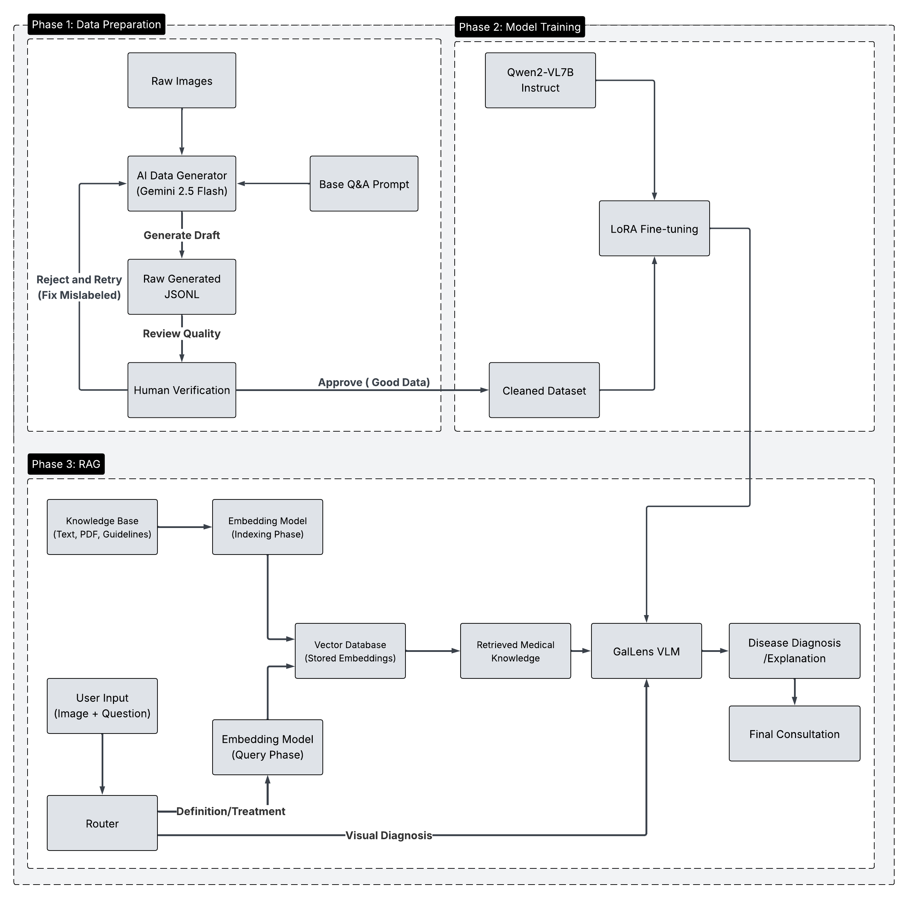

# 🐔 GalLens — Vision–Language System for Poultry Disease Diagnosis & Explanation  

GalLens is a **Vision–Language-based system** for **chicken disease diagnosis and explanation**, designed to support **non-expert poultry farmers**.

Unlike standard CNN classifiers that only output a label, GalLens:
- **Understands images** (Vision)
- **Understands language** (LLM)
- **Reasons with medical knowledge via RAG**
- Provides **human-readable explanations + treatment guidance** grounded in real veterinary documents.

This repository accompanies the undergraduate thesis:

> **Vision–Language Based Poultry Disease Diagnosis and Explanation System**  
> University of Science and Technology of Hanoi (USTH)

---

## Core Goals

GalLens answers two key questions:

1. **What disease does this chicken have?** → *Visual diagnosis*  
2. **Why and what should I do?** → *Grounded explanation + treatment via RAG*

---

## Full Workflow (Phase 3)

### High-level pipeline

1. **User input:** Image + Question  
2. **Router decides mode:**
   - If **diagnosis** → use fine-tuned VLM  
   - If **treatment / medical question** → activate RAG + VLM  
3. **If RAG is used:**
   - Retrieve relevant veterinary documents  
   - Inject knowledge into the model prompt  
4. **Final output:**
   - Disease label  
   - Natural-language explanation grounded in evidence  

---

## Two Inference Modes

### Visual Diagnosis Mode  
**Input:**  
- Chicken image  
- Question: *“What disease is this?”*

**Output:**  
- Predicted disease  
- Visual symptom explanation  

### 🔹 Medical Consultation Mode  
**Input:**  
- Text question like *“How to treat Newcastle disease?”*

**Output:**  
- Retrieved medical evidence  
- Grounded, safe explanation  

---

## Model Fine-Tuning

### Base model  
- **Qwen2-VL-7B Instruct**

### Fine-tuning method  
- **LoRA (Low-Rank Adaptation)**

### Tested configurations  
| Model | Setting |
|---|---|
| **Model A (Base)** | Zero-shot, no fine-tuning |
| **Model B (10%)** | LoRA full-linear, 10% data |
| **Model C (40%)** | LoRA full-linear, 40% data |
| **Model D** | LoRA only on Attention layers |
| **Model Final — GalLens-Integrated** | **LoRA on all linear layers (Champion)** |

---

## Retrieval-Augmented Generation (RAG)

### Knowledge sources
- Veterinary manuals  
- Medical guidelines  
- Research papers  
- PDF documents  
- Trusted agriculture websites  

### Embedding model
- **Qwen3-Embedding-0.6B**

### Vector database
- **FAISS / Chroma**

---

## Core Packages

Your project relies on:

torch
transformers
peft
accelerate
bitsandbytes
faiss-cpu
chromadb
sentence-transformers
pandas
numpy
tqdm
pillow
fastapi
uvicorn

---

## How to Run (STEP-BY-STEP)

### **1) Create environment**

bash
conda create -n gallens python=3.10
conda activate gallens

### **2) Install dependencies** 
pip install -r requirements.txt

torch
transformers
peft
accelerate
bitsandbytes
faiss-cpu
chromadb
sentence-transformers
pandas
numpy
tqdm
pillow
fastapi
uvicorn

### 3) Fine-tune the VLM (optional)**
python finetune/train_lora_qwen2_vl.py \
  --train_data data/vqa_train.jsonl \
  --model_path Qwen/Qwen2-VL-7B-Instruct \
  --output_dir models/gallens_expert

This will save:

models/gallens_expert/

### **4) Build RAG Knowledge Base**
python rag/build_kb.py \
  --docs_path rag/docs/ \
  --embed_model Qwen/Qwen3-Embedding-0.6B \
  --vector_store rag/faiss_index

### **5) Run inference
Diagnosis only
python inference/vlm_infer.py \
  --image data/sample.jpg \
  --question "What disease is this?"

Diagnosis + RAG
python inference/rag_infer.py \
  --image data/sample.jpg \
  --question "How to treat this disease?"

### **6) Run Web API (optional) **
uvicorn app:app --reload

Then open:

http://127.0.0.1:8000/docs

